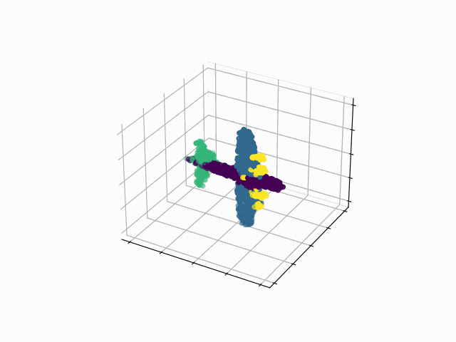

# PointNet++ Segmentation - PyTorch Implementation

## Results
### Examples from Test Set
:bulb: Notice the convergence in first steps
<table>
    <thead>
        <tr>
            <th style="text-align: center;">Ground Truth</th>
            <th style="text-align: center;">Predicted</th>
            <th style="text-align: center;">Diff.</th>
        </tr>
    </thead>
    <tr>
        <td></td>
        <td></td>
        <td></td>
    </tr>
    <tr>
        <td></td>
        <td></td>
        <td></td>
    </tr>
    <tr>
        <td></td>
        <td></td>
        <td></td>
    </tr>
</table>

### Training Process

### Accuracy
<table style="text-align: center;">
    <thead>
        <tr>
            <th>Train Set</th>
            <th>Validation Set</th>
            <th>Test Set</th>
        </tr>
    </thead>
    <tr>
        <td>92.22%</td>
        <td>91.59%</td>
        <td>91.73%</td>
    </tr>
</table>

## Usage
- Download the dataset: `make download`
- Train + Test + Visualization: `make run`

## Resources

- [Qi, C. R., Yi, L., Su, H., & Guibas, L. J. (2017). Pointnet++: Deep hierarchical feature learning on point sets in a metric space. arXiv preprint arXiv:1706.02413.](https://arxiv.org/abs/1706.02413)
- [Pointnet++ Part segmentation](https://github.com/dragonbook/pointnet2-pytorch)
